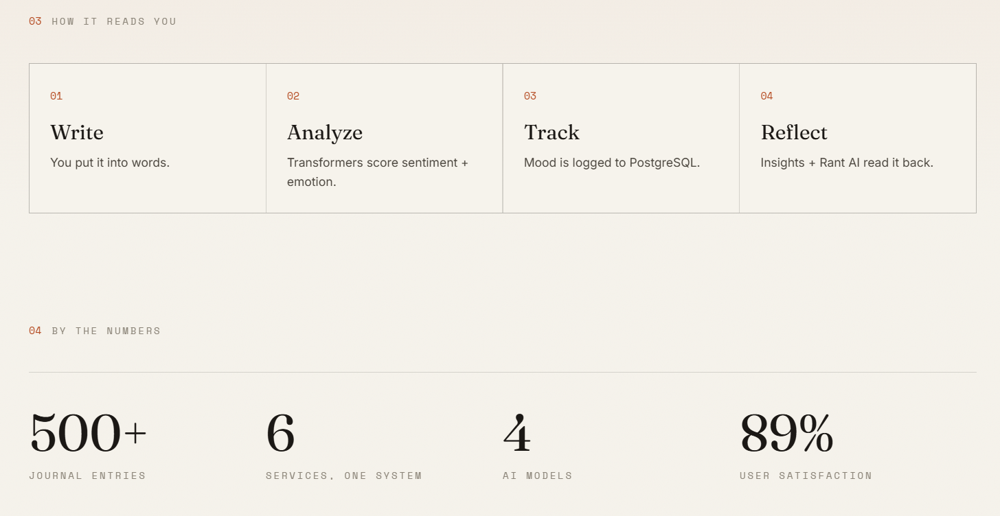
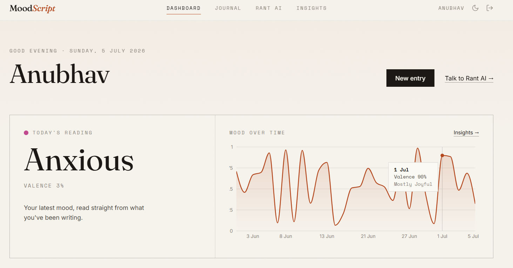
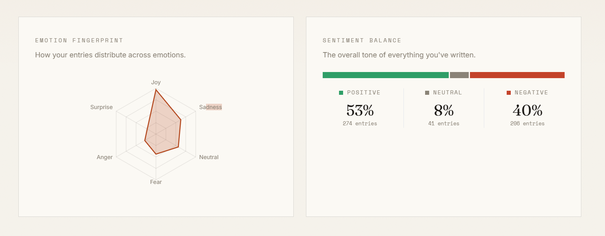
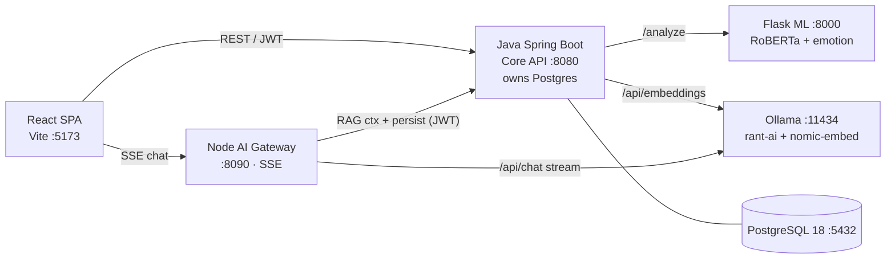
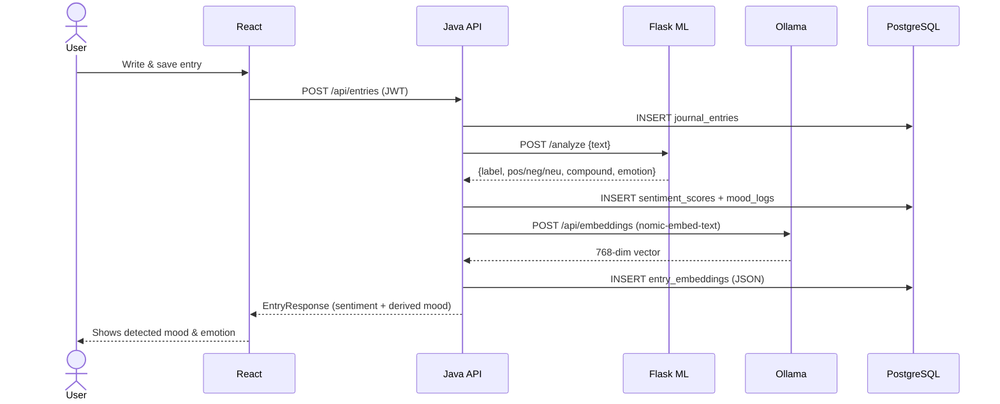
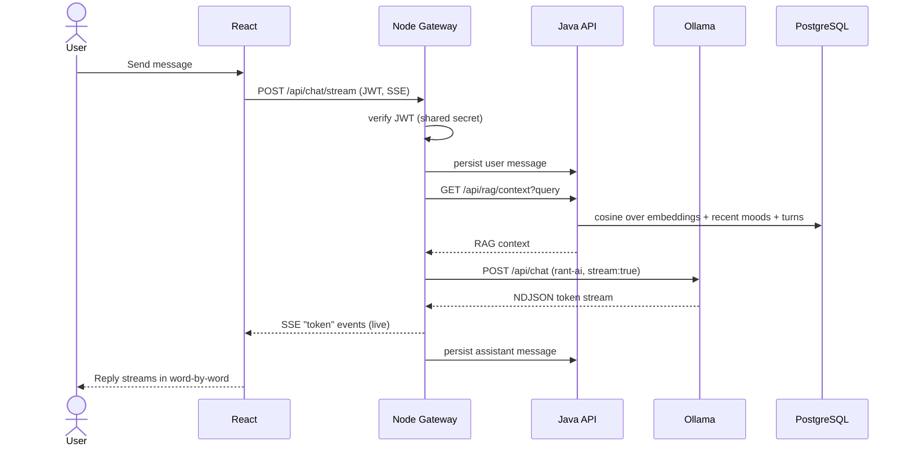
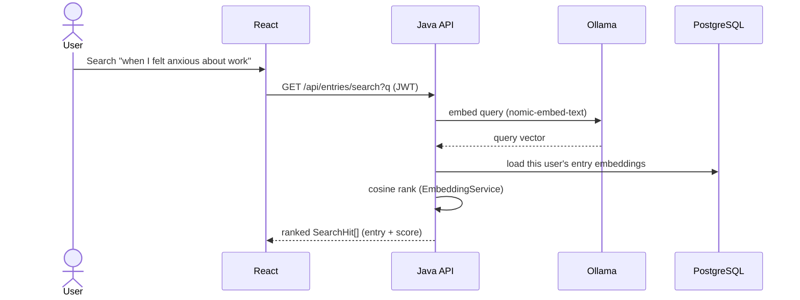
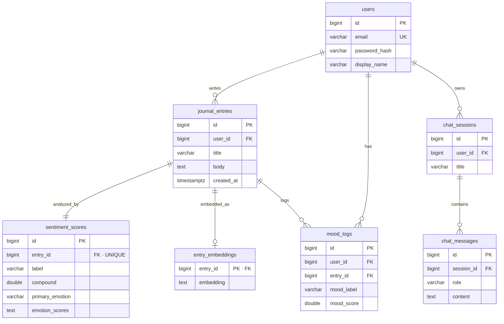

<div align="center">

# 🧠 MoodScript

### Journal your mind — and understand it.

**An intelligent journaling platform that reads the feeling behind your words.**
Every entry is analyzed by real transformer models for sentiment and emotion, your mood is tracked over
time, and **Rant AI** — an empathetic local LLM — listens and replies with warmth, grounded in your own
recent moods and journal entries.

Built as a **polyglot, distributed, full‑stack system** with live local models — no mocks, no fakes.

`React` · `Java Spring Boot` · `Python Flask` · `Node.js` · `PostgreSQL` · `Ollama`

</div>

---

## Table of contents

1. [Overview & features](#-overview--features)
2. [Screenshots](#-screenshots)
3. [Tech stack](#-tech-stack)
4. [Architecture](#-architecture)
5. [System design](#-system-design)
6. [Workflows (sequence diagrams)](#-workflows)
7. [Database schema (ER diagram)](#-database-schema)
8. [Authentication & security](#-authentication--security)
9. [Setup, seed & run](#-setup-seed--run)
10. [API reference](#-api-reference)
11. [Testing](#-testing)
12. [Project layout](#-project-layout)
13. [Design decisions](#-design-decisions)
14. [Roadmap / whats left](#-roadmap--whats-left)

---

## ✨ Overview & features

MoodScript is a personal journal where the app *understands* how you feel and reflects it back.

| Feature | What it does |
|---|---|
| 📝 **Journaling** | Full CRUD on entries with a calm, distraction‑free composer. |
| 🧬 **Transformer sentiment** | Each entry is scored by **RoBERTa** (positive/negative/neutral) + a **DistilRoBERTa emotion** model (joy, sadness, anger, fear, surprise, disgust, neutral). |
| 📈 **Mood tracking** | Every entry produces a back‑dated mood log; a living timeline, emotion radar, streaks and averages tell your story. |
| 💬 **Rant AI** | An empathetic streaming chatbot (local LLM via Ollama) that validates feelings and remembers your recent moods via **RAG**. |
| 🔎 **Semantic search** | Ask *"when did I feel anxious about work?"* and find entries by **meaning**, using embeddings + cosine similarity. |
| 🎨 **Editorial-Ink UI** | A typography-led "paper & ink" design system — Fraunces display serif, Space Mono labels, hairline rules, numbered sections and one warm terracotta/amber accent. Light "paper" and dark "ink" themes from the same tokens; no gradients or blur. |
| 🔐 **Auth** | JWT (HS512) registration/login, BCrypt‑hashed passwords, stateless APIs. |

---

## 📸 Screenshots

The UI is the **"Editorial Ink"** design system: typography-led, calm, and built for reading. Below are the
live app and real, model-generated data.

### Landing


The first screen in dark **"ink"** mode. A Fraunces display serif headline, a single warm accent, hairline
rules and a mono "issue" eyebrow — no gradients, no glassmorphism. The same tokens flip to a light "paper"
theme via the toggle.

### How it reads you



The pipeline in four moves — **Write → Analyze → Track → Reflect** — and the system at a glance: 500+ seeded
journal entries, 6 services in one distributed system, 4 AI models, all running locally.

### Dashboard



Your latest mood **read straight from what you wrote** (here, *"Anxious"*), beside a mood-over-time timeline
built from every entry's sentiment. Hovering any day shows that day's valence and dominant feeling.

### Insights



An emotion **"fingerprint"** radar across all entries and your overall **sentiment balance** — here
**53% positive · 8% neutral · 40% negative** over 520 entries. Chart colors are validated for
colorblind-safety (single hue for the radar, a semantic green/gray/red trio for balance).

### Live example (real model output)

These aren't mocked — every entry is scored by the live transformer stack. Posting this entry:

> *"I completely bombed the client demo this morning. My hands were shaking and I forgot half my slides.
> I feel like a total fraud and I keep replaying every mistake."*

returns, from **Flask (RoBERTa + DistilRoBERTa emotion)**:

```json
{
  "label": "negative",
  "pos": 0.007, "neg": 0.9547, "neu": 0.0384, "compound": -0.9477,
  "primaryEmotion": "fear",
  "emotionScores": { "fear": 0.9756, "anger": 0.0058, "sadness": 0.0045, "joy": 0.0007, "...": "..." },
  "moodLabel": "anxious", "moodScore": 0.026
}
```

And **semantic search** for `"feeling anxious about work"` — matching on *meaning*, not keywords — ranks:

```
score=0.780  #162  "Anxious again"
score=0.778  #2    "On edge"
score=0.765  #307  "Anxious again"
```

**Rant AI** then replies over SSE, streamed token-by-token and grounded in your real recent moods (RAG):

> *"Oh Anubhav, it sounds like this has been weighing heavily on your mind after the disappointing day
> you've had with the client demo. Feeling disheartened is completely natural when things don't go as
> planned… what part of this experience feels most overwhelming for you right now?"*

---

## 🧰 Tech stack

| Layer | Technology | Responsibility |
|------|------------|----------------|
| **Frontend** | React 18 + Vite + TypeScript, TailwindCSS, Framer Motion, Recharts, Zustand | Editorial-Ink UI, dashboards, streaming chat, charts |
| **Core API** | Java 21 + Spring Boot 3.3, Spring Security, JPA/Hibernate, Flyway | JWT auth, journal CRUD, mood, stats, RAG, chat persistence — **owns PostgreSQL** |
| **Sentiment ML** | Python 3.13 + Flask + Hugging Face Transformers + PyTorch | `POST /analyze` → sentiment + emotion |
| **AI Gateway** | Node.js + Express | SSE streaming of Rant AI from Ollama, RAG assembly, persistence |
| **LLM runtime** | Ollama (`rant-ai` on `phi3:mini`, `nomic-embed-text`) | Empathetic chat generation + 768‑d embeddings |
| **Database** | PostgreSQL 18 | Normalized schema, 500+ seeded entries, embeddings |

---

## 🏛 Architecture

Six processes, clean boundaries. **Only the Java service touches the database.**

```
┌─────────────┐   REST/JWT    ┌──────────────────────┐   /analyze    ┌──────────────────┐
│  React SPA  │ ────────────► │  Java Spring Boot    │ ────────────► │  Flask ML svc    │
│ (Vite:5173) │ ◄──────────── │  Core API (:8080)    │ ◄──────────── │  (:8000)         │
│ Editorial UI│               │  auth, entries, mood │               │  RoBERTa + emo   │
└─────┬───────┘               │  stats, RAG, chat DB │               └──────────────────┘
      │ SSE chat stream       │  owns PostgreSQL     │
      ▼                       └───────┬──────────────┘   /api/embeddings (nomic)
┌─────────────┐  RAG ctx + persist    │        ▲                     ┌──────────────────┐
│ Node AI     │ ─────────────────────►│        └──────────────────► │  Ollama (:11434) │
│ Gateway     │ ◄─────────────────────┘   /api/chat (rant-ai)  ────► │  phi3 + nomic    │
│ (:8090) SSE │ ──────────────────────────────────────────────────► └──────────────────┘
└─────────────┘
                        PostgreSQL 18 (:5432)  ── owned by Java, read by Java only
```

<details>
<summary><b>Same diagram as Mermaid (renders on GitHub / VS Code)</b></summary>



</details>

---

## 🧩 System design

Each unit has one job, a clear interface, and can be tested in isolation.

| Service | Owns | Talks to | Never does |
|---|---|---|---|
| **React** | UI, local auth/session state | Java (data), Gateway (chat SSE) | business logic |
| **Java Spring Boot** | System of record: auth, entries, moods, stats, embeddings, RAG, chat persistence. **Sole DB owner.** | Flask (sentiment), Ollama (embeddings), PostgreSQL | LLM generation |
| **Flask ML** | Sentiment + emotion inference | — (pure function) | DB, auth |
| **Node Gateway** | Rant AI streaming, RAG assembly | Java (context + persist), Ollama (generate) | direct DB access |
| **Ollama** | `rant-ai` chat + `nomic-embed-text` embeddings | — | — |

**Shared contract:** one HMAC `JWT_SECRET` in `.env`, so the Node gateway can verify the exact tokens the
Java backend issues. The gateway forwards the user's JWT to Java for RAG + persistence, so the database is
only ever reached through Java's authenticated endpoints.

---

## 🔄 Workflows

### 1) Create a journal entry → sentiment + mood + embedding



### 2) Rant AI streaming chat (RAG‑grounded)



### 3) Semantic search



---

## 🗄 Database schema

Normalized PostgreSQL (Flyway migration `V1__init.sql`). Embeddings and the emotion‑score map are stored
as JSON text for portability (works **with or without** the `pgvector` extension).



Foreign keys use `ON DELETE CASCADE`, so deleting an entry cleans up its sentiment, embedding and mood
rows automatically. Indexes cover `journal_entries(user_id, created_at)` and `mood_logs(user_id, created_at)`.

---

## 🔐 Authentication & security

- **Registration/login** issue an **HS512 JWT** (`sub`=userId, `email`, `name`), signed with the shared
  `JWT_SECRET`. Passwords are **BCrypt**‑hashed. (jjwt auto-selects HS512 because the shared secret is ≥64
  bytes, so the Node gateway is configured to accept `HS256`/`HS512` — both still require the same secret.)
- Java validates every request via a stateless `OncePerRequestFilter` (`JwtAuthFilter`) that populates an
  `AuthUser` principal; only `/api/auth/**`, `/actuator/**` are public.
- The **Node gateway verifies the same JWT** with the shared secret, then forwards it to Java for any DB
  work — so the gateway never holds a DB connection and the database stays behind Java's auth.

---

## 🚀 Setup, seed & run

> Windows, native (no Docker). Prereqs already on the target machine: **PostgreSQL 18** running,
> **Ollama** (`phi3:mini` + `nomic-embed-text` pulled), **Java 21**, **Node 20+**, **Python 3.11+**.
> A local Maven is downloaded automatically — no global Maven needed.

**1. Configure** — set your Postgres password:

```powershell
copy .env.example .env
# edit .env → DB_PASSWORD=<your postgres password>
```

**2. Install everything** (DB + pgvector attempt, Ollama `rant-ai` model, Python/Node deps, Java build):

```powershell
powershell -ExecutionPolicy Bypass -File scripts\setup.ps1
```

The first Flask run downloads ~500 MB of transformer weights into `ml-sentiment/models_cache/`, then runs
fully offline.

**3. Seed 500+ entries + a demo account:**

```powershell
powershell -ExecutionPolicy Bypass -File scripts\seed.ps1
```

Creates **`demo@moodscript.app` / `password123`** with 520 realistic entries across a year (each with
sentiment, emotion, a mood log, and an embedding). Start Flask + Ollama first for authentic scores; the
seeder degrades gracefully otherwise.

**4. Run all services:**

```powershell
powershell -ExecutionPolicy Bypass -File scripts\dev.ps1
```

Then open **http://localhost:5173**.

| Service | URL |
|---------|-----|
| Frontend | http://localhost:5173 |
| Core API | http://localhost:8080 (`/actuator/health`) |
| AI Gateway | http://localhost:8090/health |
| Flask ML | http://localhost:8000/health |

---

## 📡 API reference

All Java endpoints are under `/api` and require `Authorization: Bearer <jwt>` except auth routes.

| Method | Path | Purpose |
|--------|------|---------|
| POST | `/auth/register`, `/auth/login` | Create account / log in → `{ token, user }` |
| GET | `/auth/me` | Current user |
| GET | `/entries?page=&size=` | Paged list (newest first) |
| POST | `/entries` | Create entry → auto‑analyzed (sentiment + mood + embedding) |
| GET | `/entries/{id}` | Single entry with sentiment |
| PUT / DELETE | `/entries/{id}` | Update (re‑analyze) / delete |
| GET | `/entries/search?q=&topK=` | Semantic search (embeddings + cosine) |
| GET | `/moods/timeline` | Daily‑aggregated mood points |
| GET | `/moods/summary` | Current/average mood, distribution, recent |
| GET | `/stats` | Totals, writing streak, emotion + sentiment distributions |
| GET | `/chat/sessions` · POST `/chat/sessions` | List / create conversation |
| GET / POST | `/chat/sessions/{id}/messages` | History / persist a message |
| DELETE | `/chat/sessions/{id}` | Delete conversation |
| GET | `/rag/context?query=&sessionId=` | RAG context (used by the gateway) |

**Gateway (SSE):** `POST http://localhost:8090/api/chat/stream` with `{ sessionId, message }` →
`event: token` frames, then `event: done`.

**Flask:** `POST http://localhost:8000/analyze` with `{ text }` → `{ label, pos, neg, neu, compound,
primary_emotion, emotion_scores, model_name }`.

---

## 🧪 Testing

```powershell
cd backend-java;  .\mvnw.cmd test                    # JUnit — auth flow, mood mapping, cosine  (9 pass)
cd ml-sentiment;  .venv\Scripts\python -m pytest     # Flask routes                             (2 pass)
cd ai-gateway;    npm test                           # gateway — RAG prompt build, JWT verify   (4 pass)
cd frontend;      npm run build                      # type/compile check                       (clean)
```

Current status: **15 automated tests passing** across the stack; the AI streaming path
(gateway → Ollama → SSE) and real transformer inference are verified live.

---

## 📁 Project layout

```
MoodScript/
├─ README.md · HANDOFF.md · .env.example
├─ scripts/            setup.ps1 · dev.ps1 · seed.ps1 · _env.ps1
├─ ollama/Modelfile    rant-ai empathetic persona (FROM phi3:mini)
├─ backend-java/       Spring Boot core API (Maven wrapper → local Maven)
│   └─ src/main/java/com/moodscript/
│       ├─ config/     Security, JWT filter, RestClients, AppProperties
│       ├─ auth/ user/ entry/ mood/ sentiment/ embedding/ stats/ chat/
│       └─ seed/       DataSeeder (520 entries)
│   └─ src/main/resources/  application.yml · db/migration/V1__init.sql
├─ ml-sentiment/       Flask + HuggingFace (models.py, app.py, test_app.py)
├─ ai-gateway/         Node/Express SSE gateway (src/*.js, test/)
└─ frontend/           React + Vite Editorial-Ink UI (src/{pages,components,charts,lib,store})
```

---

## 🧠 Design decisions

- **Polyglot on purpose.** Java for the transactional core (auth, CRUD, integrity), Python for ML (best
  ecosystem), Node for streaming (natural fit for SSE). This mirrors a real distributed system and matches
  the resume's tech list.
- **Java owns the database; nothing else does.** Flask is a pure function, the gateway is pure streaming.
  This keeps one source of truth and one auth boundary.
- **pgvector‑optional.** Embeddings are stored as JSON text and ranked by cosine in `EmbeddingService`, so
  semantic search works whether or not the Postgres extension is installed — no hard dependency.
- **Rant AI = persona + RAG, not blind generation.** The `rant-ai` Modelfile sets an empathetic system
  prompt and sampling params; the gateway augments each turn with the user's real moods and most‑relevant
  entries so replies feel personal. (The persona is restated in `rag.js` because the API path sends its own
  system prompt.)
- **Editorial-Ink over generic dashboards.** The UI is deliberately typography-led (Fraunces + Space Mono),
  with hairline rules, numbered sections and one warm accent — a light "paper" and dark "ink" theme driven by
  the same CSS-variable tokens. It reads like a journal, not an admin panel.
- **Chart color is computed, not eyeballed.** Time‑series/radar use a single validated hue; sentiment uses
  a semantic green/gray/red trio; vibrant per‑mood identity colors appear only where a text label is always
  present (mood word, badges) — keeping the app colorblind‑safe.

---

## 🗺 Roadmap / what's left

- ✅ **Live run — complete.** The full stack has been run against real **PostgreSQL 18**: the schema is
  Flyway-migrated, **520 entries** are seeded with real sentiment + embeddings, and the whole flow (login →
  live sentiment on new entries → mood timeline → semantic search → RAG-grounded Rant AI streaming) is
  QA-verified end to end. See **`HANDOFF.md`** for the exact run commands.
- Future ideas: native `pgvector` index for scale, real LoRA fine‑tune of Rant AI, weekly mood email
  digests, export to Markdown, mobile PWA.

---

<div align="center">
Built with React · Spring Boot · Flask · Node.js · PostgreSQL · Ollama — live models, no mocks.
</div>
